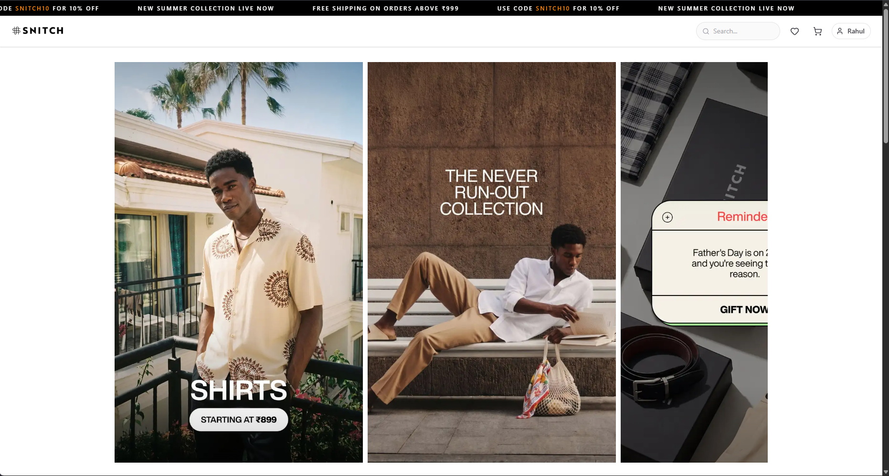
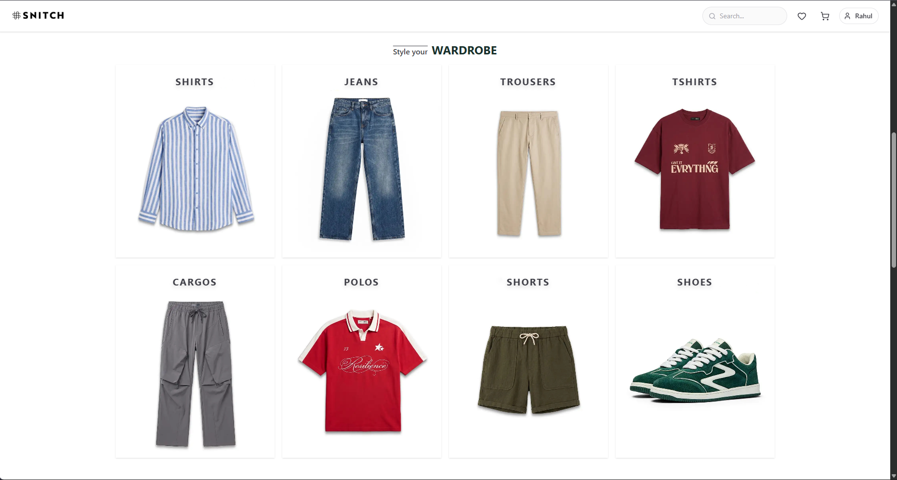
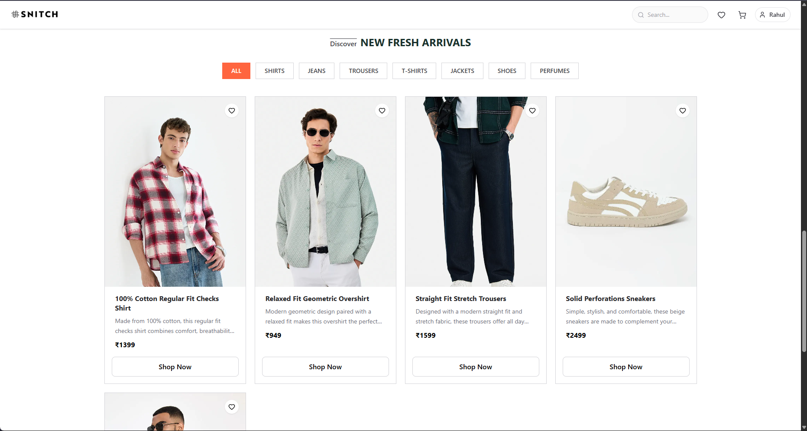
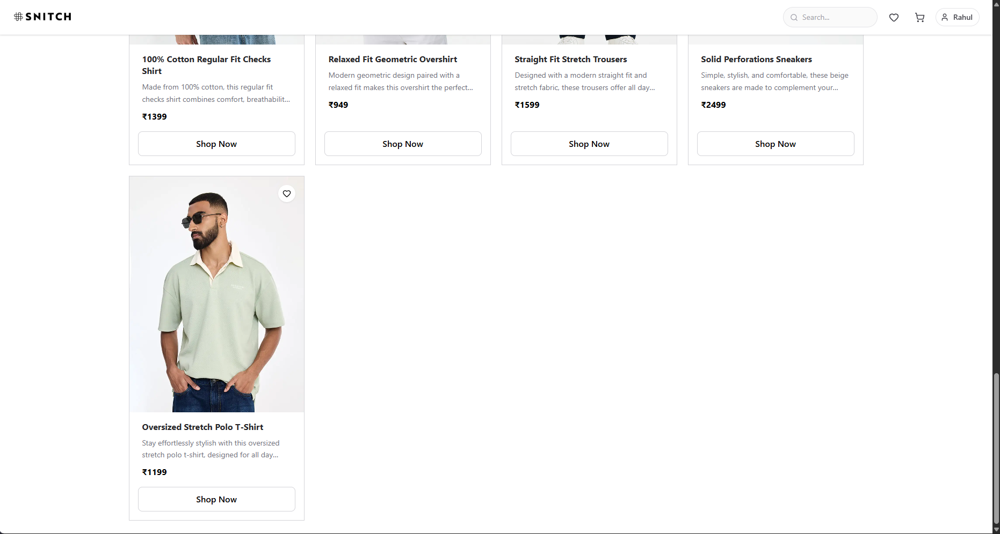
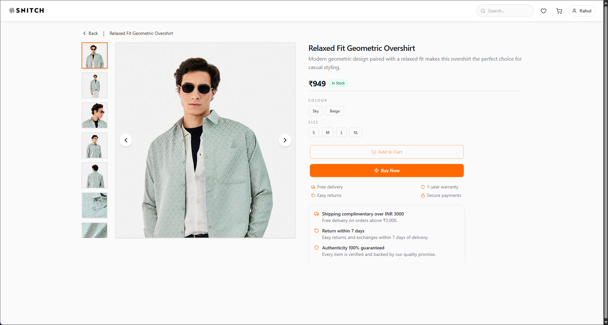
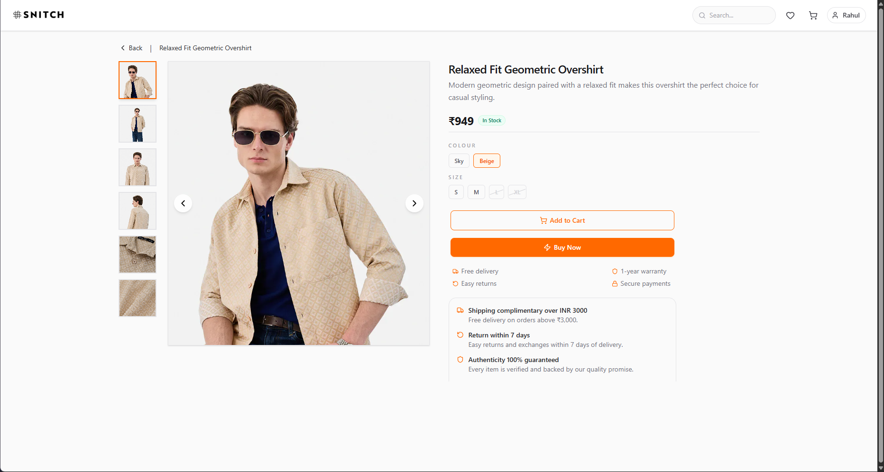

# 🛍️ Snitch Clone

## 📖 About the Project

Snitch Clone is a full-stack fashion e-commerce platform inspired by Snitch, built using the MERN stack. The project focuses on building a scalable and production-ready application by implementing secure authentication, role-based access control, and modern frontend and backend development practices. It aims to provide a seamless shopping experience while exploring the architecture of real-world e-commerce platforms.

---

## ❓ Why I Built This?

I built this project to strengthen my understanding of full-stack development concepts by working on a real-world application from scratch. Through this project, I am learning how to design secure authentication flows, build scalable REST APIs, manage application state efficiently, model databases, and structure large-scale MERN applications.

This project is still under active development, and I plan to implement modern e-commerce features such as product management, shopping cart functionality, seller dashboards, payment integration, and order management in future updates.

---

## 🛠️ Tech Stack

### 🎨 Frontend

- React.js
- Vite
- Tailwind CSS
- Redux Toolkit
- React Router
- Axios
- Lucide React

### ⚙️ Backend

- Node.js
- Express.js
- MongoDB
- Mongoose
- JWT Authentication
- Passport.js (Google OAuth)
- Express Validator
- Cookie Parser
- Bcrypt.js

---

## ✨ Current Features

### 🔐 Authentication

- User Registration
- User Login
- User Logout
- JWT-based Authentication using HTTP-only Cookies
- Google OAuth Authentication
- Role-based Registration (Buyer / Seller)
- Frontend and Backend Form Validation
- Secure Password Hashing using Bcrypt
- Server-side Error Handling
- Loading States for Authentication Requests

### 🚀 User Experience

- Fully Responsive Login and Registration Pages
- User-friendly Error Messages
- Automatic Error Message Dismissal
- Loading Animations during Authentication Requests
- Modern and Clean Authentication UI

---

## 🔮 Upcoming Features

- Product Management System
- Seller Dashboard
- Shopping Cart Functionality
- Product Variants Management
- Wishlist Functionality
- Product Search and Filtering
- Order Management System
- Payment Gateway Integration
- Reviews and Ratings
- Forgot Password and Reset Password
- Email Verification
- Protected Routes
- Deployment and Performance Optimizations

---

## 📁 Project Structure

```
snitch-clone/
├─ Backend/
│  ├─ package.json
│  ├─ package-lock.json
│  ├─ server.js
│  └─ src/
│     ├─ app.js
│     ├─ config/
│     │  ├─ config.js
│     │  └─ db.js
│     ├─ controllers/
│     │  ├─ auth.controllers.js
│     │  └─ product.controllers.js
│     ├─ middlewares/
│     │  ├─ auth.middlewares.js
│     │  └─ upload.middleware.js
│     ├─ models/
│     │  ├─ price.schema.js
│     │  ├─ product.model.js
│     │  └─ user.model.js
│     ├─ routes/
│     │  ├─ auth.routes.js
│     │  └─ product.routes.js
│     ├─ services/
│     │  └─ storage.service.js
│     └─ validators/
│        ├─ auth.validators.js
│        └─ product.validator.js
│
├─ Frontend/
│  ├─ package.json
│  ├─ package-lock.json
│  ├─ vite.config.js
│  ├─ eslint.config.js
│  ├─ index.html
│  ├─ public/
│  │  └─ snitch-favicon.ico
│  └─ src/
│     ├─ main.jsx
│     ├─ index.css
│     ├─ assets/
│     ├─ app/
│     │  ├─ App.jsx
│     │  ├─ app.routes.jsx
│     │  ├─ app.store.js
│     │  └─ App.css
│     └─ features/
│        ├─ auth/
│        │  ├─ components/
│        │  │  ├─ ContinueWithGoogle.jsx
│        │  │  ├─ ImageSection.jsx
│        │  │  ├─ ProtectedRoute.jsx
│        │  │  ├─ PublicRoute.jsx
│        │  │  └─ TitleLogo.jsx
│        │  ├─ hook/
│        │  │  └─ useAuth.js
│        │  ├─ pages/
│        │  │  ├─ Login.jsx
│        │  │  └─ Register.jsx
│        │  ├─ service/
│        │  │  └─ auth.api.js
│        │  └─ state/
│        │     └─ auth.slice.js
│        └─ product/
│           ├─ components/
│           │  ├─ Navbar.jsx
│           │  ├─ ProductForm.jsx
│           │  ├─ ProductPreviewCard.jsx
│           │  └─ SideNavBar.jsx
│           ├─ hook/
│           │  └─ useProduct.js
│           ├─ pages/
│           │  ├─ CreateProduct.jsx
│           │  ├─ Dashboard.jsx
│           │  ├─ Home.jsx
│           │  ├─ ProductDetails.jsx
│           │  ├─ Profile.jsx
│           │  ├─ SellerCustomers.jsx
│           │  ├─ SellerOrders.jsx
│           │  ├─ SellerProductDetails.jsx
│           │  ├─ SellerProducts.jsx
│           │  ├─ SellerSettings.jsx
│           │  └─ Wishlist.jsx
│           ├─ service/
│           │  └─ product.api.js
│           └─ state/
│              └─ product.slice.js
│
└─ README.md
```

---

## 📸 Preview

### Home Pages

| | |
|---|---|
|  |  |
|  |  |


### Product Details Pages
| | |
|---|---|
|  |  |

---

## 🚀 Get Started

### 📋 Prerequisites

- Node.js 18 or later
- npm
- MongoDB Atlas or a local MongoDB instance
- Cloudinary account (for image uploads)
- Google Cloud Project (for Google OAuth authentication)

---

### 📥 Clone the Repository

```bash
git clone <your-repo-url>
cd snitch-clone
```

---

### 🔧 Backend Setup

1. Navigate to the Backend folder

```bash
cd Backend
```

2. Install dependencies

```bash
npm install
```

3. Create a `.env` file in the `Backend` directory

```
PORT=7000
FRONTEND_URL=http://localhost:5174
BACKEND_URL=http://localhost:7000
MONGODB_URI=your_mongo_uri_here
JWT_SECRET=your_jwt_secret
GOOGLE_CLIENT_ID=your_google_client_id
GOOGLE_CLIENT_SECRET=your_google_client_secret
IMAGEKIT_PRIVATE_KEY=your_imagekit_private_key_here
```

4. Start the Backend Server

```bash
npm run dev
# or
npm start
```

### 🖥️ Frontend Setup

1. Navigate to the Frontend folder

```bash
cd ../Frontend
```

2. Install dependencies

```bash
npm install
```

3. Start the Development Server

```bash
npm run dev
```

4. Open the app at `http://localhost:5174`

### 📦 Build for Production

```bash
cd Frontend
npm run build
# serve the static files using any static server or deploy to a static host
```
The production build will be generated inside the `dist/` folder.

---

## 👨‍💻 Author

**Rahul Kumar**

- GitHub: https://github.com/rahul4work
- LinkedIn: https://linkedin.com/in/kumar-rahul4work/

---

## 📄 License

This project is shared for learning and portfolio purposes only.

Please do not redistribute or use it commercially without permission